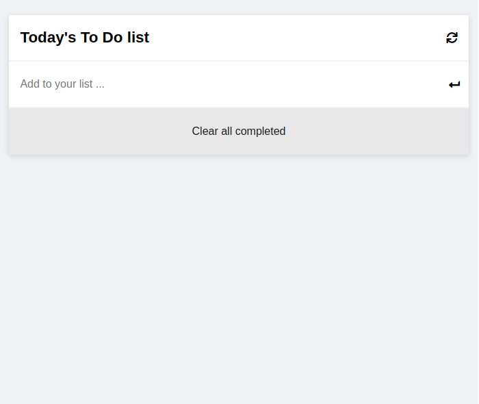
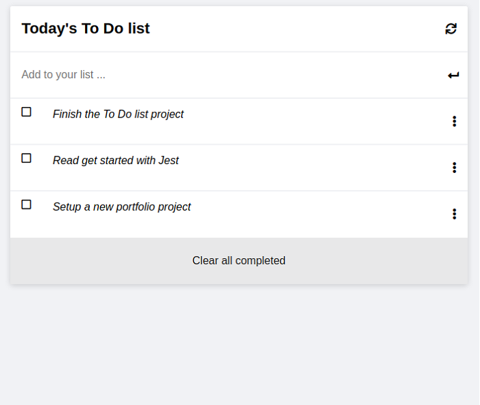
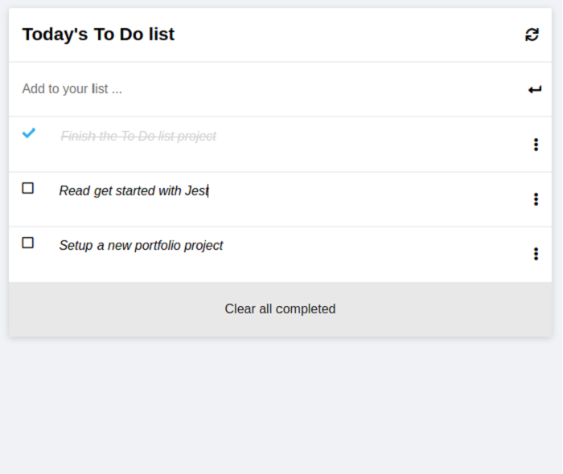
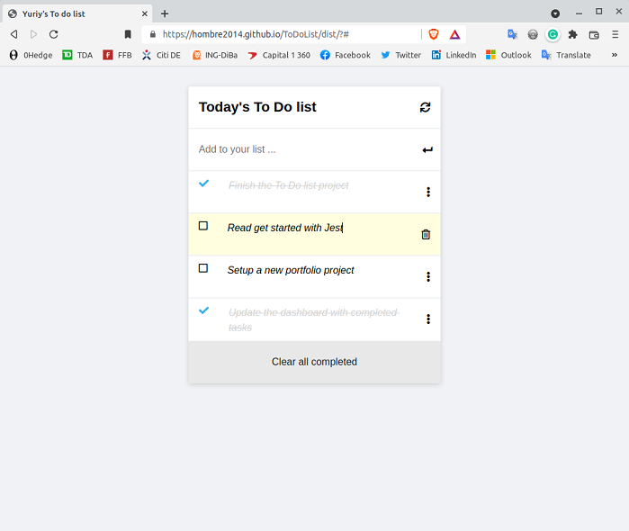
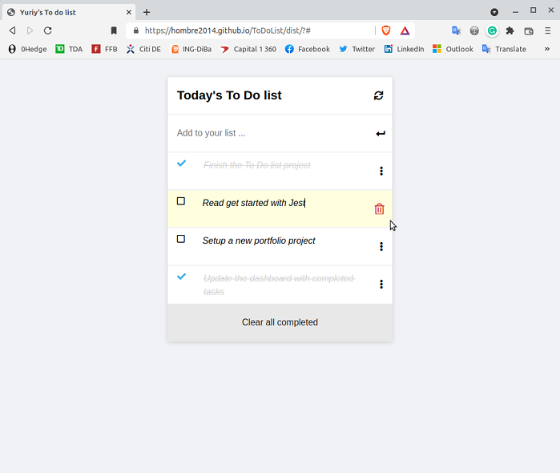

# Yuriy Chamkoriyski's To Do List project

> Second Javascript project from Module 2 at Microverse

In this project, you will build a simple HTML list of To Do tasks. The list will be styled according to the specifications listed later in this lesson. This simple web page will be built using webpack and served by a webpack dev server.

## List structure (step 1):

- [x] Set up a new project with webpack that is based on the webpack exercise you have already completed.
- [x] Create an index.html file and write your HTML markup here. Create an empty To Do List placeholder (`
` or `<ul>` element). The index.html file must be set as a template using the HTML Webpack Plugin.
- [x] Create an index.js file and set an array of some simple to do tasks (array of objects). Each task object should contain three keys:
  - [x] i.   description [string].
  - [x] ii.  completed [bool].
  - [x] iii. index: [number].
- [x] Write a function to iterate over the tasks array and populate an HTML list item element for each task.
- [x] On page load render the dynamically created list of tasks in the dedicated placeholder. The list should appear in order of the index values for each task.
- [x] Create a style.css and set rules for the To Do List. CSS must be loaded by Webpack Style/CSS Loader. Your list should be a clone of the part of the minimalist project captured in the video below.

[Video](https://www.youtube.com/watch?v=AcUd-_Yjjqg)

## Interactive list (step 2):

- [x] Add a new JavaScript files and import it as a module:
  - [x] it will contain methods related to the status updates (`completed`: `true` / `false`).
- [x] Add event listener to the checkbox (`change`).
- [x] Update items object's value for `completed` key upon user actions.
- [x] Store the updated array of items in local storage, so the user gets the correct list values after the page reloads.

## Add & remove functions (step 3):

- [x] Remove all hardcoded items from the tasks array.
- [x] Create a new JavaScript file for the new functionality.
- [x] Implement a function for adding a new task (add a new element to the array).
- [x] Implement a function for editing task descriptions.
- [x] Implement a function for deleting a task (remove an element from the array).
- [x] Implement a function for the "Clear all completed" button (use `filter()` method).
- [x] By default new tasks should have the property `completed` set to `false` and the property index set to the value of the new array length (i.e. if you're adding a 5th task to the list, the index of that task should equal to 5).
- [x] Deleting a task should update all remaining items' indexes, so they represent the current list order and are unique.
- [x] All changes to the To Do List should be saved in local storage.

## Built With

- Major languages: HTML, CSS, JS
- Frameworks: none
- Technologies used: Git, webpack

## Live Demo

- [Live Demo](https://hombre2014.github.io/ToDoList/dist/)

## Source code

- [GitHub source code link](https://github.com/Hombre2014/ToDoList)

## Getting Started

To get a local copy up and running follow these steps.

### Prerequisites

- Internet connection and browser
- A text editor preferably ([Visual Studio Code](https://code.visualstudio.com/))
- Browser

### Setup

- For detail description of how to get started with webpack, please, look at: [webpack](https://webpack.js.org/guides/getting-started/)

### Install

- [Git](https://git-scm.com/downloads)
- [Node](https://nodejs.org/en/download/)

### Usage

- Clone the repository using "`git clone git@github.com:Hombre2014/ToDoList.git`"
- Change directory into the project folder `cd ToDoList`
- Run `npm install`
- Run `npm start`
- A new browser will open automatically with application loaded

### Run tests

- Passed Lighthouse, webhint, Stylelint and ESLint tests

### Deployment

- All the files necessary for deployment are in the `/dist` folder

## Author

👤 **Yuriy Chamkoriyski**

- GitHub: [@Hombre2014](https://github.com/Hombre2014)
- Twitter: [@Chamkoriyski](https://twitter.com/Chamkoriyski)
- LinkedIn: [axebit](https://linkedin.com/in/axebit)

## 🤝 Contributing

Contributions, issues, and feature requests are welcome!

Feel free to check the [issues page](https://github.com/Hombre2014/ToDoList/issues).

## Show your support

Give a ⭐️ if you like this project!

## Acknowledgments

This is a solo project, but I want to thanks my partners at  for making it better. 

- Special thanks to [Bohdan Shcherbak](https://github.com/akucintavalent) for offering his help and collaboration during third phase of the project.
- Thanks to my learning and coding partners for their inputs and code reviews: [SadiQ Habil](https://github.com/kingqabil), especially [Anuar Shaidenov](https://github.com/anuarshaidenov) for his support and dedication, [Mong'are](https://github.com/Mosams) and [abdessalem1998](https://github.com/abdessalem1998).
- Thanks [Anselem Odimegwu](https://github.com/AnselemOdims) for helping me troubleshooting some issues.

## 📝 License

This project is [MIT](./license.md) licensed.